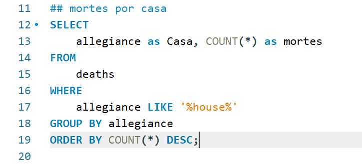
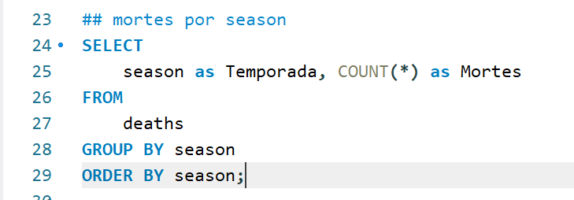
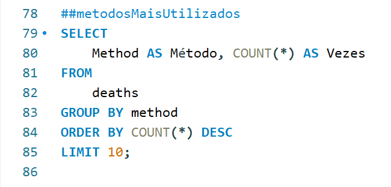
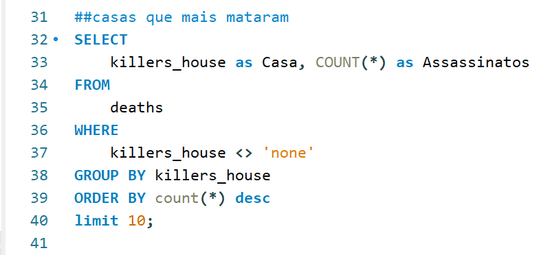
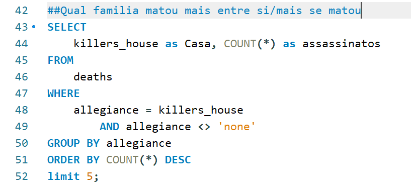
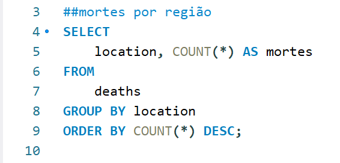
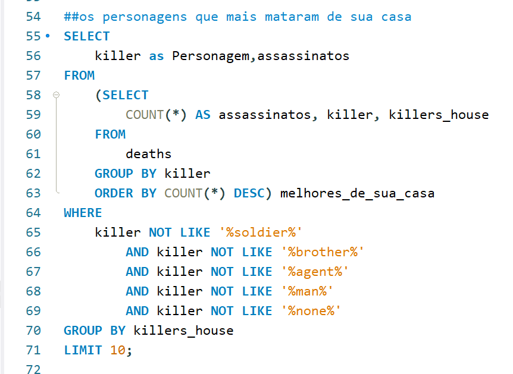
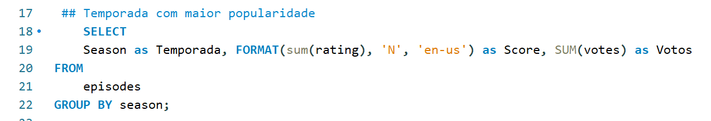
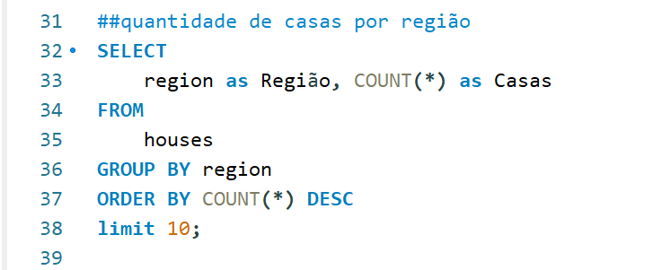
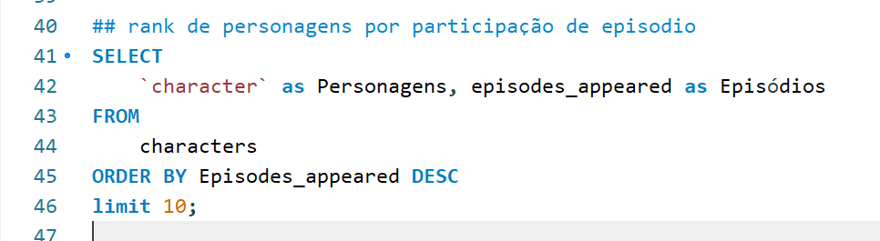

# <h1>GAME OF THRONES</h1>

Projeto final do módulo 3 da formação em Desenvolvimento Web Full Stack da Resilia Educação.

Link para a página [aqui](https://moreira-edu.github.io/Projeto-M3/)

# Tecnologias utilizadas:
- [x] MYSQL.
- [x] HTML5.
- [x] CSS3.
- [x] Bootstrap5.
- [x] JavaScript.
- [x] Jquery.
- [x] Google Charts.

  
  
  ## Mortes por casa
  
    
    
  ## Quantas mortes por temporada
  
    
    
  ## Mortes por armas e métodos
  
    
  
  ## Qual familia matou mais
    
    
  
  ## Qual familia matou mais entre si/mais se matou
  
    
    
  ## Mortes Por Região
  
   
   
   ## Os personagens que mais mataram por casa
  
   
   
   ## As temporadas mais populares de got
  
   
   
    ## Quantidades de casa por região
  
   
   
    ## Rank de personagens que mais participaram de episodios
  
   

# Equipe:
 * [Edu Moreira](https://www.linkedin.com/in/edu-moreira-aa9304226/)
 * [Fernanda Pereira](https://www.linkedin.com/in/fernandapereiradasilva/)
 * [Kaio Novais](https://www.linkedin.com/in/kaio-novais-1085a9200)
 * [Luciana Vivarelli](https://www.linkedin.com/in/luciana-vivarelli-valgode-34640815a/)
 * [Patricia Milane](https://www.linkedin.com/in/patmilane/)
 * [Raphael Vicentini](https://www.linkedin.com/in/raphael-victor-pereira-vicentini-10a81272)
